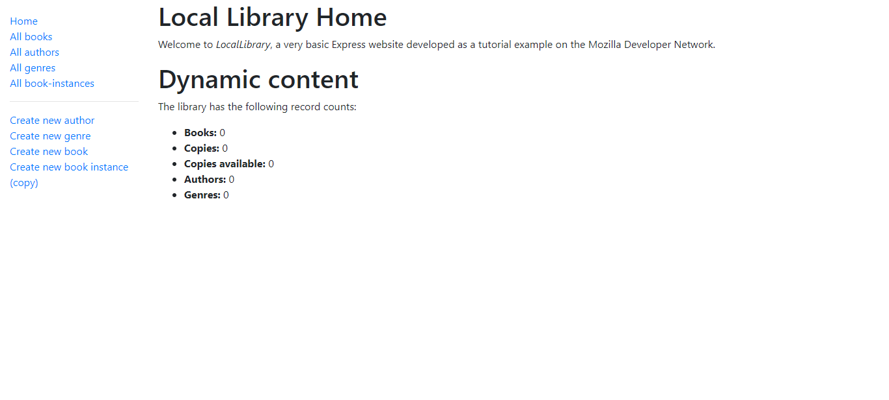

# Local Library

This was build with guidance from the Mozilla firebox [tutorial](https://developer.mozilla.org/en-US/docs/Learn/Server-side/Express_Nodejs/Tutorial_local_library_website)

A local library made with express. It has several features such as

- View books, authors, genres, book instances and their respective individual detail pages
- Add, update or delete a book
- Add, update or delete an author
- Add, update or delete a genre
- Add, update or delete a book instance

## Live

[Click here](https://locallibrary-production-f318.up.railway.app)

## Demo

